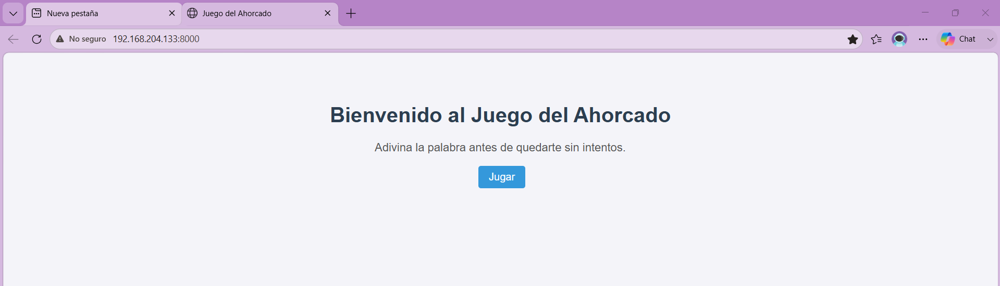
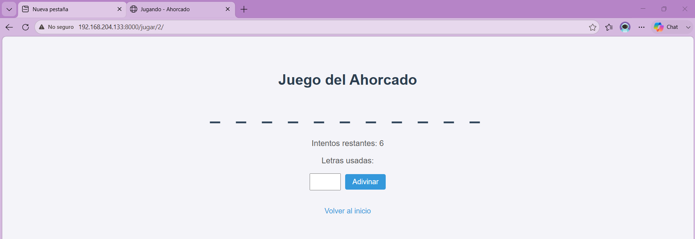
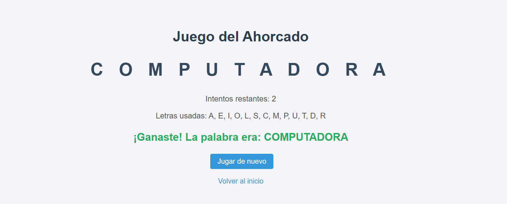
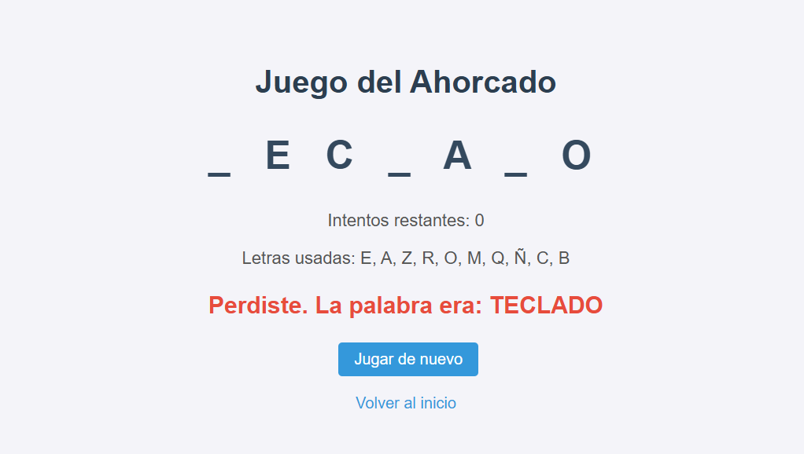

# Hangman Django Docker

Juego del ahorcado desarrollado con Python, Django y Docker.

## Tecnologías utilizadas

- Python 3.12
- Django 5.0.6
- Docker y Docker Compose
- SQLite

## Características

- Selección aleatoria de palabra al iniciar cada partida
- Seguimiento de letras adivinadas y letras usadas
- Conteo de intentos restantes (6 intentos por partida)
- Detección automática de victoria o derrota
- Persistencia de cada partida en base de datos
- Interfaz visual con CSS personalizado

## 📸 Capturas del juego

### Pantalla de inicio

### Partida en curso

### Victoria

### Derrota

## Cómo ejecutar el proyecto

1. Clonar el repositorio:
git clone https://github.com/Vanessa1356458/hangman-django-docker.git
cd hangman-django-docker

2. Construir la imagen de Docker:

3. Levantar el contenedor:

4. Abrir en el navegador:
http://localhost:8000

## Estructura del proyecto
hangman-django-docker/
├── config/
├── hangman/
├── Dockerfile
├── docker-compose.yml
├── requirements.txt
└── manage.py

## Autora

Vanessa - Ingeniería en Sistemas
